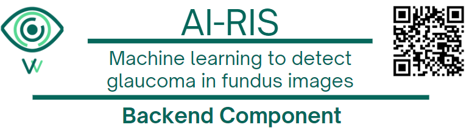

<h1 align="center">

<br></br>
AIRIS
<br></br>
Backend Component
</h1>

<h3 align="center">
This directory contains the backend component of the AIRIS platform, responsible for managing data processing, analysis, and model deployment.
</h3>

---
Developed as part of an undergraduate thesis in **Biomedical Engineering** at **Universidad de los Andes**, Bogotá, Colombia (June 2025).

---

## Features
- Data processing and analysis pipelines
- Model deployment and management
- Integration with machine learning models
- RESTful API for interaction with frontend components
- FastAPI for building APIs with Python 3.6+ based on standard Python type hints
- Asynchronous support for high performance
---

## Goals
The backend component of AIRIS is designed to provide a robust and scalable infrastructure for the AIRIS platform, enabling efficient data processing and analysis for glaucoma detection. It serves as the backbone of the system, facilitating communication between the frontend and machine learning models.
It is built using FastAPI, a modern web framework for building APIs with Python, which allows for high performance and easy integration with machine learning models.

The primary goals of the backend component of AIRIS are:
- Provide a robust and scalable backend for the AIRIS platform.
- Ensure seamless integration with frontend components and machine learning models.
- Optimize data processing and analysis workflows for performance and accuracy.

---

## Technical Details
- **Programming Language**: Python
- **Machine Learning Framework**: scikit-learn, PyTorch, OpenCV
- **Data Storage**: Local file system for image storage
- **Framework**: FastAPI
- **Asynchronous Support**: Yes


## Workflow
The backend component of AIRIS follows a structured workflow:

1. **Data Ingestion**: The backend receives images of the bottom eye from the frontend.
   - The images are uploaded through the RESTful API and stored in a designated directory for further processing.
2. **Preprocessing**: The backend processes the images to prepare them for analysis.
   - The images are resized and converted to tensors, ensuring they are in the correct format for the machine learning models.
   - Quality control is performed using a deep learning architecture (ResNet) for feature extraction, followed by classification using a Support Vector Machine (SVM) model.
    - The SVM predicts the quality of the images, and only those with good quality are send to the next step.
3. **Descriptor Extraction**: The backend extracts features from the images, such as border and color descriptors.
   - These features are crucial for identifying glaucoma-related changes in the eye images.
4. **Model Prediction**: The backend uses the extracted features to make predictions about the presence of glaucoma.
   - The Random Forest model is used to classify the images based on the extracted descriptors.

---

## Component Diagram
The component diagram below illustrates the architecture of the backend component, showing how it interacts with other components of the AIRIS platform. The diagram includes the FastAPI server, data processing pipelines, and the machine learning models used for glaucoma detection.


---

## API Endpoints

The backend provides a RESTful API for interaction with the frontend components. The API endpoints include:
- `POST **/upload**`: Endpoint for uploading images of the bottom eye.
    - Request Body: Multipart form-data with the image file.
        ```json
        {
            "file": <image_file>
        }
        ```
        
    - Response: JSON object with a success message and the filename of the uploaded image.
        ```json
        {
            "mensaje": "Archivo guardado con éxito",
            "filename": "example.jpg"
        }
        ```


- `GET **/predecir**`: Endpoint for predicting the presence of glaucoma in the uploaded images.
    
    - Request Body: JSON object with the filename of the image to be analyzed.
        ```json
        {
            "filename": "example.jpg"
        }
        ```
    - Response: JSON object with the prediction results.
        ```json
        {
            "Recomendacion": "No se han detectado signos de glaucoma. Recuerda que los exámenes periódicos son clave para la prevención.",
            "Probabilidad": "0.85",
        }
        ```

