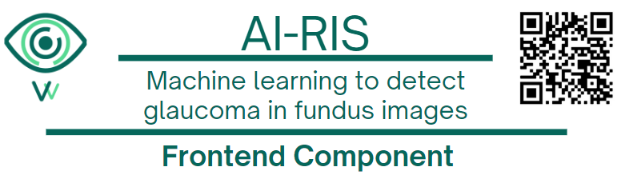

<h1 align="center">

  
AIRIS
  
Frontend Component
</h1>

<h3 align="center">
This directory contains the frontend component of the AIRIS platform, responsible for providing a user-friendly interface for data input and visualization.
</h3>

---
Developed as part of an undergraduate thesis in **Biomedical Engineering** at **Universidad de los Andes**, Bogotá, Colombia (June 2025).

---

## Features

- Responsive design (desktop and mobile friendly)
- User-friendly interface for data input and visualization
- Integration with backend API for data processing and analysis
- React Router for navigation between different views
- State management using React Context API
- Upload functionality for images of the bottom eye
- Visualization of analysis results

---

## Goals
The frontend component of AIRIS is designed to provide a user-friendly interface for interacting with the platform. It allows users to upload images of the bottom eye, visualize analysis results, and navigate through different views of the application. The primary goals of the frontend component are:
- Provide a responsive and intuitive user interface for data input and visualization.
- Ensure seamless integration with the backend API for data processing and analysis.
- Enable users to easily upload images and view analysis results.
---
## Technical Details
- **Programming Language**: JavaScript (React.js)
- **Framework**: React.js
- **Routing**: React Router for navigation
- **State Management**: React Context API for managing application state
- **Styling**: CSS for styling components
- **Build Tool**: Create React App for easy setup and development
- **Image Upload**: Functionality to upload images of the bottom eye for analysis
- **Visualization**: Display analysis results in a user-friendly manner
---

