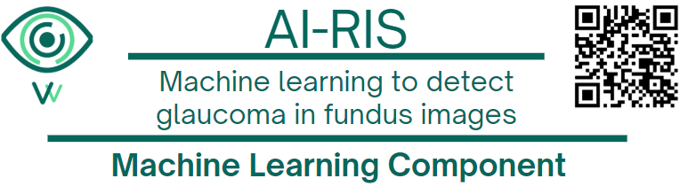
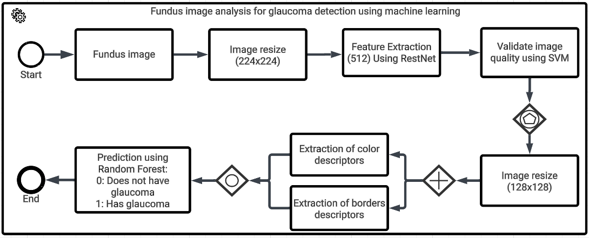
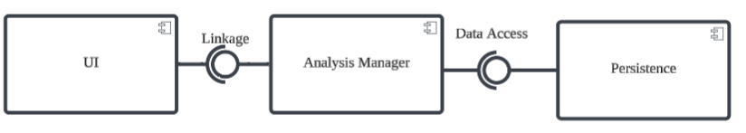
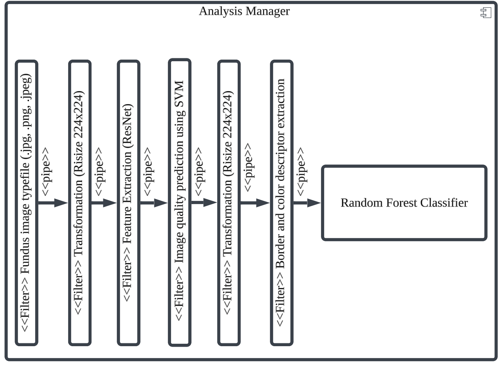
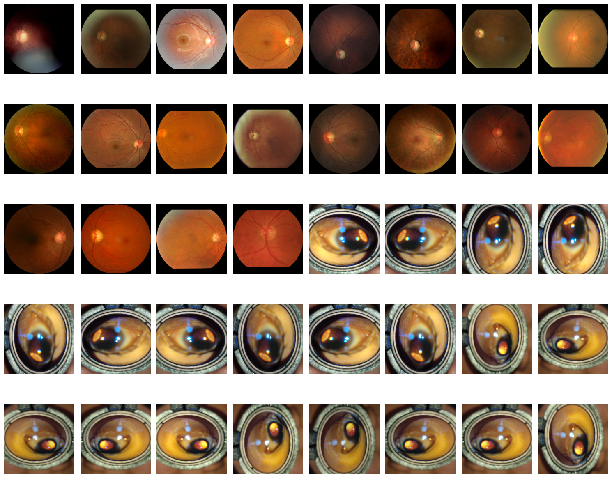

<h1 align="center">

  
AIRIS
  
Machine Learning Component
</h1>

<h3 align="center">
This directory contains the machine learning models and scripts used for glaucoma diagnosis in the AIRIS platform.
</h3>

---

## Features

- Data cleaning and preprocessing pipelines
- Jupyter notebooks for data exploration and modeling
- Final trained models
- Model evaluation scripts

---

## Workflow
The machine learning component of AIRIS follows a structured workflow:
1. **Preprocessing**: Data is resized and converted to tensors.
    - **Preprocessing 1**: The data is cleaned and prepared for training. This includes resizing images, normalizing pixel values, and converting them into tensors suitable for model input.
    - **Quality Control**: The data is checked for quality and consistency using a deep learning architecture (ResNet) for feature extraction. The features are then input to a Support Vector Machine (SVM) model for classification.
        - **Training**: The SVM model is trained on the preprocessed data.
        - **Testing**: The model is tested on a separate dataset to evaluate its performance.
        - **Evaluation**: The model's performance is evaluated using metrics such as accuracy, precision, recall, and F1-score.

    The SVM predicts if the images have good quality or not, and the images with good quality are used for training the Random Forest model.

    - **Preprocessing 2**: If the image is of good quality, they are resized to 128x128 pixels and is the input to the Random Forest model.

2. **Descriptor Extraction**: The pipeline extracts features from the images, such as border and color descriptors.
    - **Border Descriptors**: These features capture the edges and contours of the eye images, which are crucial for identifying glaucoma-related changes.
    - **Color Descriptors**: These features analyze the color distribution in the images, helping to differentiate between healthy and glaucomatous eyes.
3. **Prediction**: The extracted features are used to train and evaluate machine learning models.
    - **Model Training**: The models are trained on the preprocessed data, using the extracted descriptors as input.
    - **Model Evaluation**: The trained models are evaluated on a validation set to ensure they generalize well to unseen data.
    - **Final Model**: The best-performing random forest model is selected for deployment.

4. **Deployment**: The trained models are saved and can be deployed for real-time predictions.

This image illustrates the workflow of the machine learning component:

---

## Technical Details
- **Component Diagram**: The component diagram below illustrates the architecture of the machine learning component, showing how it interacts with other components of the AIRIS platform. The component diagram includes the machine learning models, preprocessing pipelines, and the analysis manager that orchestrates the entire process. The next image shows the component diagram of the machine learning component:

- **Component Diagram Analysis Manager**: The component diagram Analysis Manager is responsible for managing the machine learning models, including filter model and glaucoma detection model.  The analysis manager have and execute the pipelines for preprocessing, descriptor extraction, and prediction. The next image shows the component diagram of the analysis manager:

---
## What it predicts

This component predicts the likelihood of glaucoma based on various eye-related features. The models are trained to classify whether a patient has glaucoma or not, providing valuable insights for early diagnosis and treatment.

Our models utilize features such as border and color descriptors, as well as other eye-related metrics to make predictions. The models are designed to be robust and accurate, leveraging advanced machine learning techniques. Before making predictions, the data undergoes thorough preprocessing to ensure quality and reliability. The models are trained on a diverse dataset to generalize well across different patient profiles. The next image show a sample of the data used for training:

You can find the trained models in the `models` directory. For the final code used to train the models, refer to the [`Final_Model_with_images_of_VitaVision.ipynb`](https://github.com/aarevalom0/AIris-MachineLearning/blob/master/Machine_Learning_Model/notebooks/Final_Model_with_images_of_VitaVision.ipynb) in the [`notebooks`](https://github.com/aarevalom0/AIris-MachineLearning/tree/master/Machine_Learning_Model/notebooks) directory.

---

## Ethical considerations or limitations

- **Bias in Data**: The models are only as good as the data they are trained on. If the training data is biased or unrepresentative, the model's predictions may also be biased. In this case, we need to take more images with our universal support to ensure a diverse and representative dataset.
- **Clinical Validation**: The models need to be validated in clinical settings to ensure their effectiveness and safety before being used in practice.
- **Data Privacy**: Handling sensitive medical data requires strict adherence to privacy regulations and ethical guidelines to protect patient information.

---
## Demostration

You can find a demonstration of the machine learning component in the [**Demo**]()

---

## 📦 Technologies

- Python 3.10
- Scikit-learn
- TensorFlow / Keras
- Pandas, NumPy, Matplotlib
- Jupyter Notebooks

---

