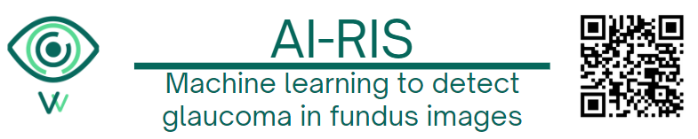

<div style="display: flex; align-items: center;">

</div>


<h1 align="center">
AIRIS 

Machine Learning Platform for Glaucoma Diagnosis
</h1>

<h3 align="center">
It is an intelligent platform that integrates machine learning models with a modern frontend and a robust backend, offering predictive information for advanced diagnosis and decision-making in glaucoma.
</h3>

---

## Project Structure

- **Frontend**: User interface (React.js) for interaction with AIRIS. The frontend allows users to input data, visualize results, and interact with the machine learning models. You can find the frontend code in the [`Front`](https://github.com/aarevalom0/AIris-MachineLearning/tree/master/Front) directory.

- **Backend**: API services (FastAPI) for communication between frontend and machine learning models. The backend handles requests from the frontend, processes data, and returns predictions. You can find the backend code in the [`Backend`](https://github.com/aarevalom0/AIris-MachineLearning/tree/master/Backend) directory.

- **Machine Learning**: Predictive models and data processing (Python, Scikit-learn, TensorFlow). The machine learning code includes model training, evaluation, and prediction logic. You can find the machine learning code in the [`Machine_Learning_Model`](https://github.com/aarevalom0/AIris-MachineLearning/tree/master/Machine_Learning_Model) directory.

- **Documentation**: Project documentation and API specifications. The documentation provides details on how to use the platform, including API endpoints and model descriptions. You can find the documentation in the [`Docs`](https://github.com/aarevalom0/AIris-MachineLearning/tree/master/Docs) directory.

---

## Features

- User-friendly interface for data input and visualization
- Integration of machine learning models for glaucoma diagnosis
- RESTful API endpoints for model predictions
- Machine Learning models for classification of glaucoma
- Documentation for easy understanding and usage
- Robust backend for handling requests and processing data
- Scalable architecture for future enhancements

---
## Installation and Usage
### Prerequisites
- Python 3.8 or higher
- Node.js 14 or higher


### Installation
1. Clone the repository:
   ```bash
   git clone https://github.com/aarevalom0/AIris-MachineLearning.git
   cd AIris-MachineLearning
   ```

2. Set up the backend:
   ```bash
   cd Backend
   pip install -r requirements.txt
   ```

3. Set up the frontend:
   ```bash
   cd Front
   cd ai-ris-website
   npm install
   ```

4. Set up the machine learning environment:
   ```bash
   cd Machine_Learning_Model
   pip install -r requirements.txt
   ```

### Usage
1. Start the backend server:
   ```bash
   cd Backend
   uvicorn APIRest:app --reload
   ```

2. Start the frontend development server:
   ```bash
   cd Front
   npm start
   ```

3. Access the application at `http://localhost:3000`.


## Thesis Project Context

This project was developed as part of the undergraduate thesis for the Biomedical Engineering degree at Universidad de los Andes, Bogotá, Colombia, and was formally presented in 2025. It forms a key component of the research initiative VitaVision, which proposes an accessible, low-cost solution for early glaucoma screening by combining artificial intelligence with portable fundus imaging using smartphone-based optical support.

The code, datasets, and models presented in this repository form a core component of the research and technical validation carried out during the thesis process. All documentation, methodology, and results are aligned with the objectives of the VitaVision thesis project, which integrates biomedical engineering, machine learning, and digital health innovation.